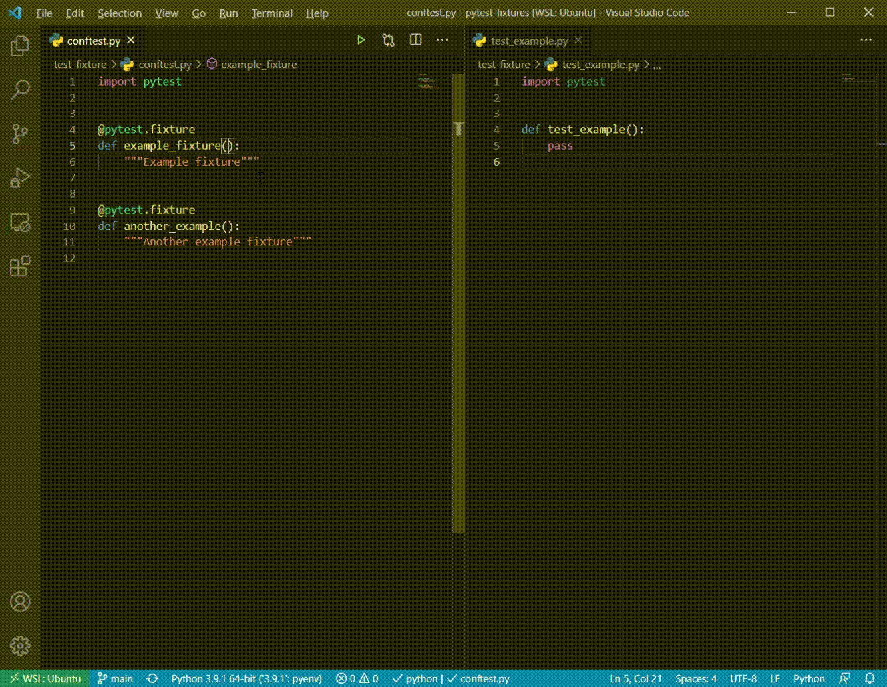

# pytest-fixtures README

VSCode extension to provide intellisense for Pytest Fixtures. Inspired by [pytest-vscode](https://github.com/cameronmaske/pytest-vscode). Uses `pytest --fixtures` to get fixture information.

## Demo



## Features

* Autocomplete suggestions for parameters of test functions where fixtures may be used. Includes docstrings. Context aware of different fixtures available for each file.
* Go To Definition support. Uses pytest output to determine location of fixture.

Will first check `"python.testing.pytestPath"` for pytest, then will fallback on `python -m pytest` with the selected interpreter.

## Optional extra command line arguments for pytest to discover fixtures

In the .vscode/settings.json you can add the extra arguments and the plugin uses this args if exist.


`"pytest-fixtures.extra_arguments"` is an arry of string.

```json
{
    "pytest-fixtures.extra_arguments": [
        "-p",
        "abc.pytest.common.bootstrap",
    ]
}
```

## Requirements

* Python
* pytest
* (Optionally) pytest-asyncio


## Known Issues

* Does not support typing of fixture parameters.
* Python extension provides a self-referential definition of function parameters so there will be two definitions, see [here](https://github.com/microsoft/vscode-python/issues/18536)

## Release Notes

[Change Log](CHANGELOG.md)
